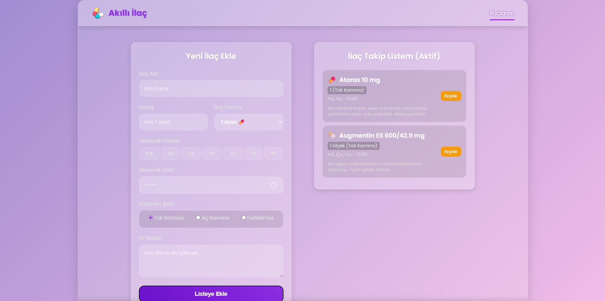
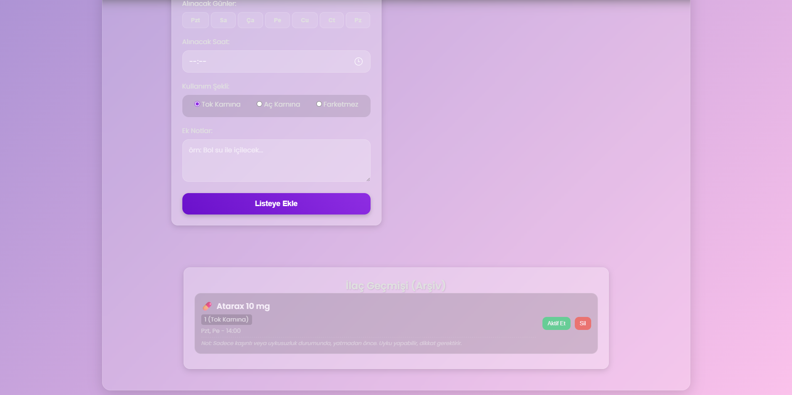

# Akıllı İlaç Hatırlatıcı • Full-Stack Projesi 💊

Bu proje, hastaların ilaç takip planlarını oluşturmasını, yönetmesini ve arşivlemesini sağlayan tam kapsamlı (full-stack) bir web uygulamasıdır.

Bu portfolyo projesi, modern ve kurumsal bir teknoloji yığını kullanarak (React, Nest.JS, TypeScript, TypeORM) sıfırdan tam bir **CRUD (Create, Read, Update, Delete)** uygulamasının nasıl inşa edildiğini sergilemek amacıyla geliştirilmiştir.

---

## 🚀 Proje Demosu ve Ekran Görüntüleri

Aşağıda uygulamanın ana özelliklerini (ilaç ekleme, listeleme ve arşivleme) gösteren ekran görüntüleri yer almaktadır.




*(Bu bölüme projenin çalıştığını gösteren bir ekran kaydı (GIF/MP4) eklemeniz, projenin etkisini daha da artıracaktır.)*

---

## 🛠️ Kullanılan Teknolojiler (Tech Stack)

Bu proje, iki ana modülden oluşan bir **monorepo** yapısındadır:

### Frontend (Müşteri Arayüzü)
* **React (v18+):** Modern kullanıcı arayüzleri için temel kütüphane.
* **React Hooks (`useState`, `useEffect`):** Bileşenlerin state (durum) ve yaşam döngüsü yönetimi.
* **CSS3 (Glassmorphism):** Modern, cam efektli ve duyarlı (responsive) tasarım.
* **Fetch API (async/await):** Backend ile asenkron iletişim kurmak için.

### Backend (Sunucu ve Veri Tabanı)
* **Nest.JS (TypeScript):** Güçlü, ölçeklenebilir ve kurumsal Node.js framework'ü.
* **TypeScript:** Koda tip güvenliği (type-safety) ekleyerek hataları en aza indiren dil.
* **TypeORM:** Veritabanı ile "Arşiv Uzmanı" (`AppService`) arasında köprü kuran modern ORM (Object-Relational Mapper).
* **SQLite:** Geliştirme ortamı için hızlı, dosya tabanlı ve **kalıcı** veritabanı.

---

## ✨ Temel Özellikler

* **Tam CRUD Fonksiyonelliği:** İlaçlar için kalıcı Ekleme (Create), Okuma (Read), Güncelleme (Update) ve Silme (Delete) işlemleri.
* **Zenginleştirilmiş İlaç Formu:** İlaç adı, dozaj, ilaç formu (tablet, şurup vb.), kullanım şekli (aç/tok), alınacak günler (Pzt, Sa...) ve ek notlar.
* **Kalıcı Durum Yönetimi:** İlaçları "Arşivleme" (`aktif: false`) ve "Aktif Etme" (`aktif: true`) özellikleri.
* **Kalıcı Veritabanı:** `Nest.JS` sunucusu yeniden başlasa bile, `TypeORM` ve `SQLite` sayesinde veriler kaybolmaz.
* **Full-Stack Entegrasyonu:** React (Frontend) ile Nest.JS (Backend) arasında `CORS` ayarları yapılmış, tam entegre bir API iletişimi.

---

## 🏁 Projeyi Yerel (Local) Olarak Çalıştırma

Bu projeyi kendi bilgisayarınızda çalıştırmak için:

1.  **Depoyu Klonlayın:**
    ```bash
    git clone [https://github.com/Utkusert98/AKILLI-ILAC-HATIRLATICI.git](https://github.com/Utkusert98/AKILLI-ILAC-HATIRLATICI.git)
    cd AKILLI-ILAC-HATIRLATICI
    ```

2.  **Backend'i Başlatın (Terminal 1):**
    ```bash
    cd backend
    npm install
    
    # Not: Veritabanı (ilaclar.sqlite.db) dosyası, 
    # 'app.module.ts' içindeki 'synchronize: true' ayarı sayesinde 
    # ilk 'start:dev' komutuyla otomatik olarak oluşacaktır.
    
    npm run start:dev
    # Backend artık http://localhost:8000 adresinde çalışıyor.
    ```

3.  **Frontend'i Başlatın (Terminal 2):**
    ```bash
    cd frontend
    npm install
    npm start
    # Frontend artık http://localhost:3000 adresinde açılacak.
    ```
